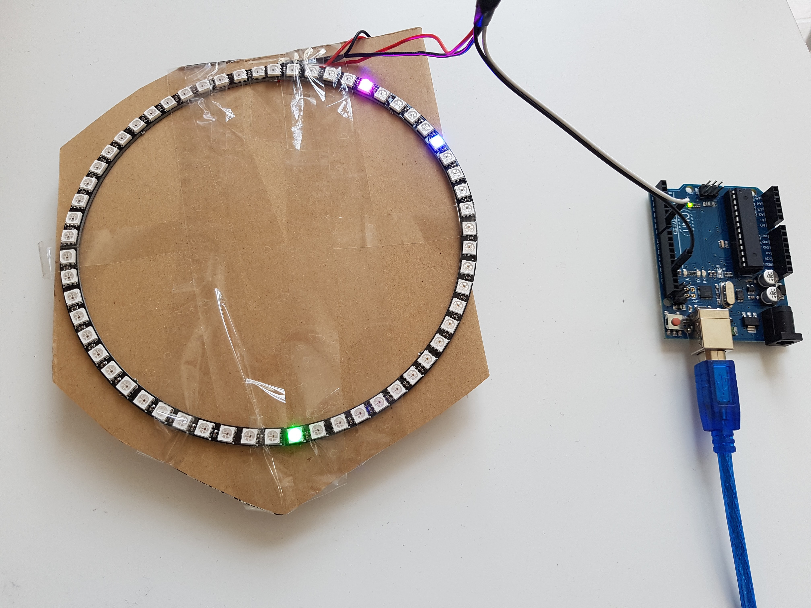

# neoclock-js  

> A NeoPixel wall clock made with JavaScript

## Hardware

Buy from [adafruit](https://www.adafruit.com/categories/184) or [AliExpress](https://www.aliexpress.com/wholesale?catId=0&initiative_id=SB_20160910210158&SearchText=ws2812+60+arduino)

[WS2812 datasheet](https://cdn-shop.adafruit.com/datasheets/WS2812.pdf)

## Usage

1. Setup your NeoPixel (Ring Wall Clock 60 X Ultra Bright WS2812 5050 RGB LED Lamp Panel)
1. Connect DIN to pin 6 on Arduino
1. Clone this repo
1. Run `npm install && npm run setup`
1. Run `npm start`

*NOTE*: The first pixel is 0 (or 60) on a clock

### REPL

There are a few commands you can type in REPL

#### time()

Get current time for debug

#### strip

The [strip object](https://github.com/ajfisher/node-pixel#strip)

## Further reading

https://www.adafruit.com/category/168

https://github.com/ajfisher/node-pixel

http://johnny-five.io/

https://www.arduino.cc/

## Contributing

I build this for fun. I really want to try some crazy ideas! Do you have any? Send us a PR!

## License

MIT © [Steve Mao](https://github.com/stevemao)
